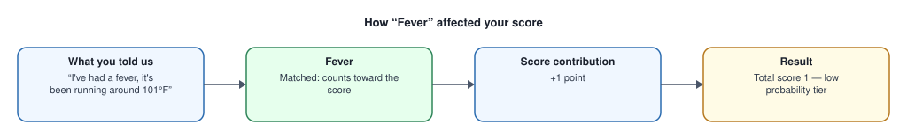
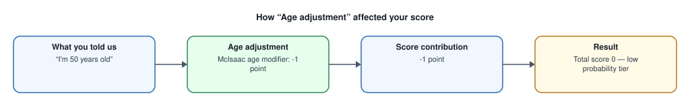

# Your Sore Throat Assessment — How Your Score Was Calculated

> This is an educational explanation based on validated clinical scoring criteria, not a diagnosis.

**Your Modified Centor (McIsaac) score: 1** (low probability tier, score 1)

**What this range means (published data):** In validation studies, 5%-10% of people in this range were found to have streptococcal pharyngitis (strep throat).

**Probability estimate source:**
*McIsaac WJ, Kellner JD, Aufricht P, Vanjaka A, Low DE. Empirical validation of guidelines for the management of pharyngitis in children and adults. JAMA. 2004;291(13):1587-1595.*

---

## What contributed to your score

### Fever — +1 point

- **You told us:** “I've had a fever, it's been running around 101°F”
- **Explanation:** [PLACEHOLDER — template 'modified_centor.fever.present' not yet written/reviewed. Real sentence to be authored and human-reviewed before production use.]

### Age adjustment (age 30) — this did not change your score

- **You told us:** “I'm 30 years old”
- **Explanation:** [PLACEHOLDER — template 'modified_centor.age_modifier.age_15_to_44' not yet written/reviewed. Real sentence to be authored and human-reviewed before production use.]

## What did NOT contribute

These criteria were checked and not matched (0 points each): Absence of cough, Tender neck lymph nodes, Tonsillar exudate/swelling.

## Pending clinical evaluation

This is a PARTIAL score. The following require in-person assessment and are not included: Rapid strep test / throat culture.

---

> This is an educational explanation based on validated clinical scoring criteria, not a diagnosis.

**Scoring criteria source:**
*Centor RM, et al. Med Decis Making. 1981;1(3):239-46; McIsaac WJ, et al. CMAJ. 1998;158(1):75-83.*
