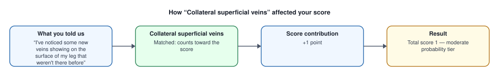

# Your Leg Swelling Assessment — How Your Score Was Calculated

> This is an educational explanation based on validated clinical scoring criteria, not a diagnosis.

**Your Wells' DVT score: 1** (moderate probability tier, score 1-2)

**What this range means (published data):** In pooled studies, 17% (95% CI 13%-23%) of people in this range were found to have a DVT.

**Probability estimate source:**
*Wells PS, Owen C, Doucette S, Fergusson D, Tran H. Does this patient have deep vein thrombosis? JAMA. 2006;295(2):199-207.*

---

## What contributed to your score

### Collateral superficial veins — +1 point

- **You told us:** “I've noticed some new veins showing on the surface of my leg that weren't there before”
- **Explanation:** [PLACEHOLDER — template 'wells_dvt.collateral_veins.present' not yet written/reviewed. Real sentence to be authored and human-reviewed before production use.]

## What did NOT contribute

These criteria were checked and not matched (0 points each): Active cancer, Paralysis / immobilization, Bedridden / recent surgery, Localized tenderness, Entire leg swollen, Calf swelling >3 cm, Pitting edema.

## Pending clinical evaluation

This is a PARTIAL score. The following require in-person assessment and are not included: Alternative diagnosis assessment, D-dimer / ultrasound.

---

> This is an educational explanation based on validated clinical scoring criteria, not a diagnosis.

**Scoring criteria source:**
*Wells PS, et al. 'Evaluation of D-dimer in the diagnosis of suspected deep-vein thrombosis.' N Engl J Med. 2003;349(13):1227-35.*
